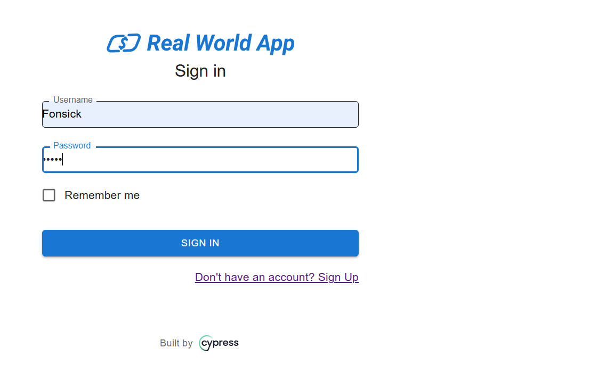
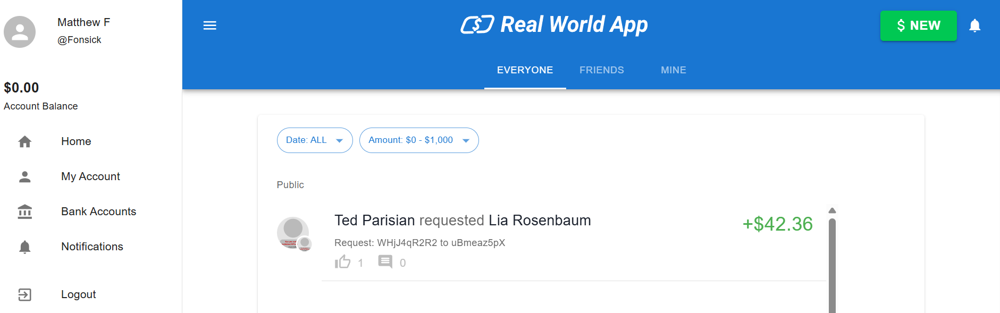

#CT 001 - Login com sucesso

**Descrição:** Verificar se é possível fazer login com um usuário válido, inserindo as informações corretas.

**Pré-condições:** 
- Usuário existente cadastrado de forma correta no sistema.
- Credencias de login válidas (usuário e senha)

**Passo a passo:**

1. Acessar página de login do sistema Real World App.
2. Inserir um usuário válido no campo de "Username".
3. Inserir uma senha váliida no campo de "Password".
4. Clicar no botão de cadastro.

**Resultado esperado:**
- O sistema autentica o usuário e a ação de login ocorre normalmente, redirecionando para a página inicial.

**Resultado obtido:**
- Sistema autenticou o usuário e foi redirecionado para a página inicial.

**Status:**
- Passou.

##Evidências:

**Tela inicial:**

**Tela após login bem sucedido:**

