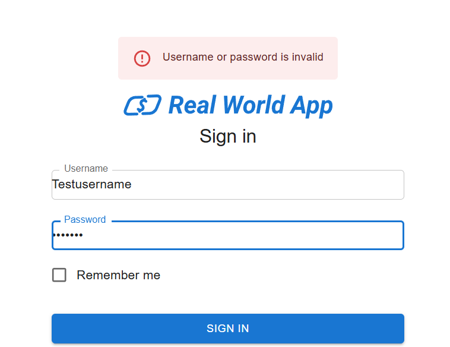

#CT 002: Login com credenciais inválidas

**Descrição:** Garantir que o sistema exiba uma mensagem de erro ao tentar fazer login com credenciais inválidas (username ou password incorretos).

**Pré-condições:** 
- Usuário ou senha existente não cadastrado de forma correta no sistema.
- Credencias de login inválidas (usuário ou senha).

**Passo a passo:**
1. Acessar página de login do sistema Real World App.
2. Inserir um usuário inválido no campo de "Username".
3. Inserir uma senha inválida no campo de "Password".
4. Clicar no botão de "Sign In".

**Resultado esperado:**
- O sistema deve exibir uma mensagem de erro clara, como: "Username or password is invalid".
- O usuário não deve ser autenticado e não deve ser redirecionado para a página inicial.

**Resultado obtido:** 
- Sistema não autenticou o usuário/senha e apresentou mensagem de falha ao tentar realizar o login.

**Status:**
- Passou.

## Evidências

