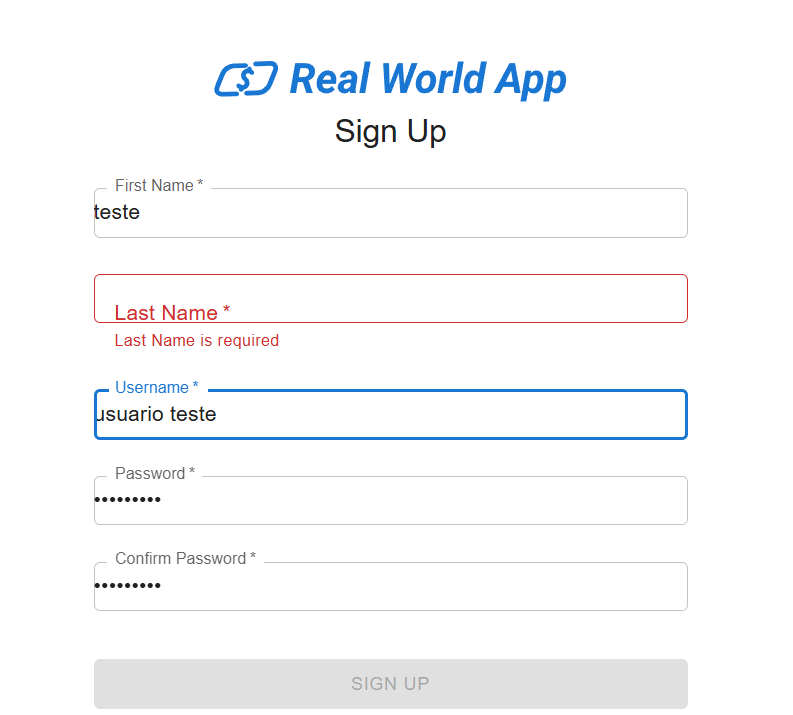

# CT004 - Cadastro de novo usuário com credenciais válidas

**Descrição:**
Verificar se o sistema permite o cadastro de um novo usuário ucom informações incompletas e se apresenta mensagem de erro ao tentar registrar.

**Pré-condições:**
- Acessar a página de registro de usuário no sistema.

**Passo a passo:**
1. Acessar o site do sistema.
2. Navegar até a página de registro de usuário.
3. Preencher todos os campos obrigatórios com dados válidos menos o campo "Lastname":
   - Firstname: `teste`
   - Lastname: Não preencher este campo
   - Username: `usuario teste`
   - Senha: `Senha@123`
   - Confirmação de senha: `Senha@123`
4. Clicar no botão **Sign Up**.

5. Verificar se após a criação do novo usuário com será redirecionado para a página de login.

**Resultado esperado:**
- Deve aparecer uma mensagem de erro na no campo que ficou vazio por faltar informações.
- O botão "Sign up" não deve ficar clicável pela falta de informações. 

**Resultado obtido:**
- O usuário não conseguiu realizar o novo cadastro devido a falta de informações necessárias.

**Status:**
- Passou

## Evidências
**Tela de registro sem informações completas:**

